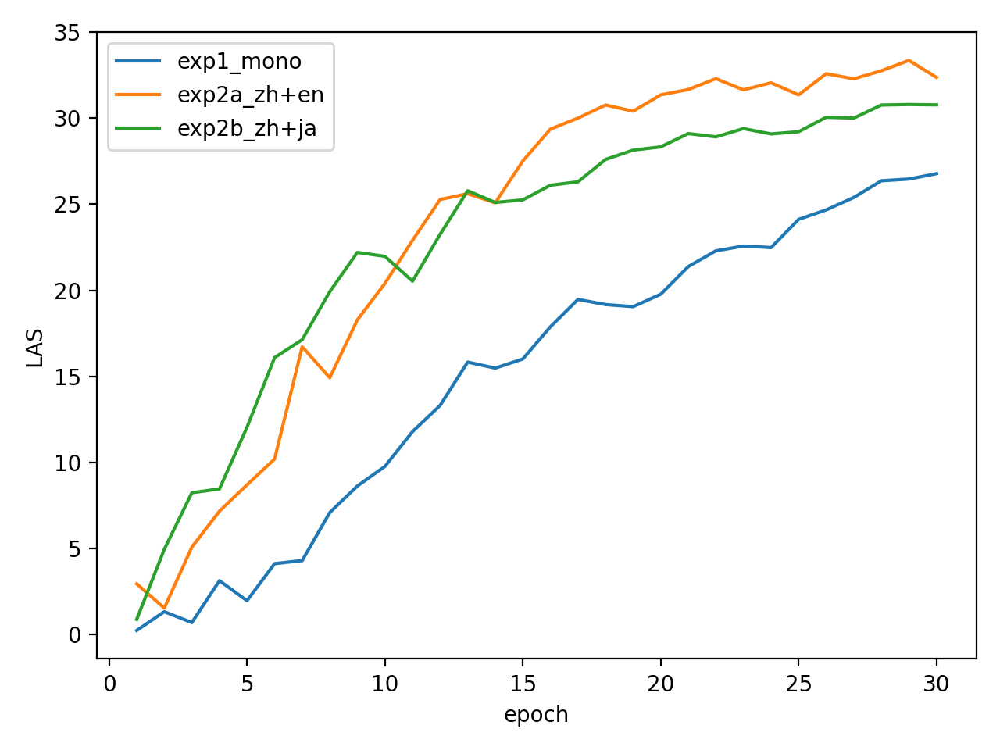
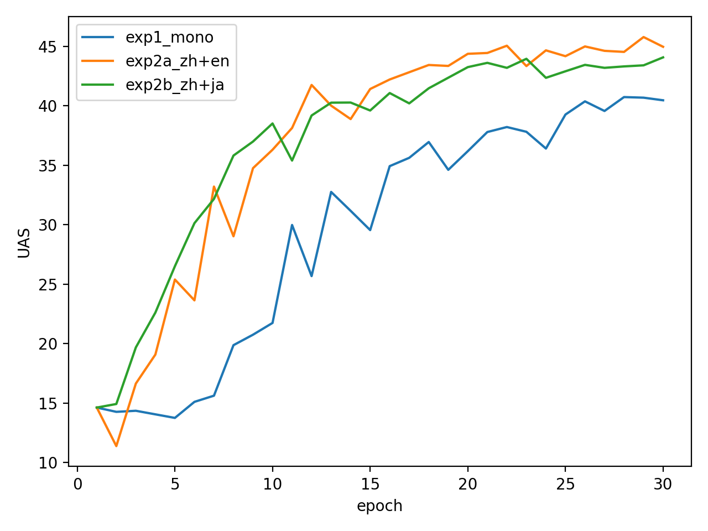

# Cross-Lingual Dependency Parsing

> **Coursework notice:** This repository contains a completed exercise from a Natural Language Processing course. It is published as an educational record of the experiments and analysis.

This project studies whether multilingual training improves dependency parsing for Chinese in a low-resource setting. It compares a Chinese-only parser with Chinese–English and Chinese–Japanese transfer settings using Universal Dependencies treebanks.

## Recorded results

| Training setting | Best epoch by Chinese LAS | UAS | LAS |
| --- | ---: | ---: | ---: |
| Chinese only | 30 | 40.47 | 26.77 |
| Chinese + English | 29 | 45.79 | 33.35 |
| Chinese + Japanese | 29 | 43.41 | 30.79 |

Both multilingual settings improved over the Chinese-only exercise baseline. English transfer produced the highest recorded Chinese UAS and LAS in these runs.

## Repository contents

- `results/scores.csv` — epoch-level UAS and LAS values.
- `results/root_compare.tsv` — sentence-level comparison of predicted root tokens.
- `figures/` — learning curves and selected dependency-tree visualizations.
- `scripts/plot_learning_curves.py` — regenerates the learning-curve figures from the published score table.
- `scripts/root_statistics.py` — compares root predictions across transfer settings.

## Data and reproducibility

The original experiments used Universal Dependencies Chinese GSD, English EWT, and Japanese GSD data. Download those treebanks from the [Universal Dependencies project](https://universaldependencies.org/) and follow their individual licenses.

Large datasets, trained parser models, intermediate epoch predictions, course instructions, and local cluster files are intentionally excluded. The scripts document the analysis workflow; reproducing the complete training run also requires the parser setup used in the course exercise.
